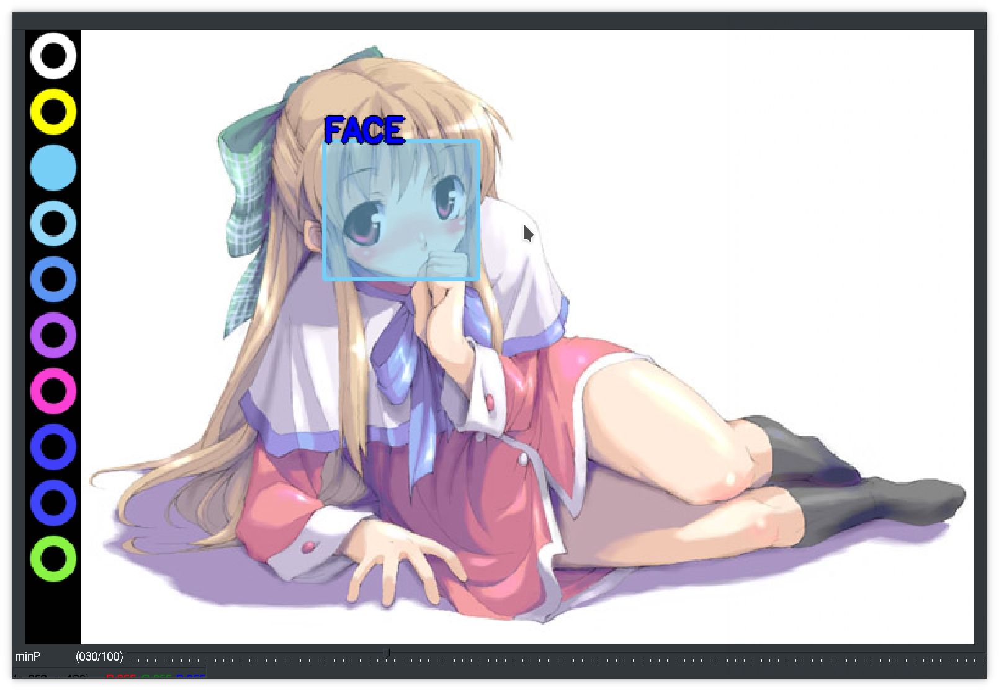

# CV2DataSetLabeler
Label data sets for machine learning with a customizable UI written in Python CV2

# Setup
1. Fill out config.json with your paths.
2. Run generateMetadata.py to generate the required metadata files.
3. If you want [YOLO](https://github.com/qqwweee/keras-yolo3) to generate labels for you to perfect, you'll need to download or generate weights as an .h5 file and put it into config.json->"modelPath".

# Usage
* Start with python DataSetLabeler.py
### Keyboard shortcuts:
* Save image and go to next: Space bar
* Skip image: c
* Go to last image: x
* Toggle selection mode: s
* Delete all selected boxes: e
* Toggle label hints on the left: i
* Jump to last edited image: j
* Use YOLO to predict boxes: p
* Quit: escape
* Toggle label visibility: h
* Undo: z
* Redo: y
* Select Label: 1-0 on the keyboard
* Save image with Boxes: enter

# Training
1. Make sure you have any YOLO pretrained model as a .h5 file and configured train.py correctly (see [YOLO](https://github.com/qqwweee/keras-yolo3) for information).
2. Call train.py
3. Modify config.json to use your new model.
